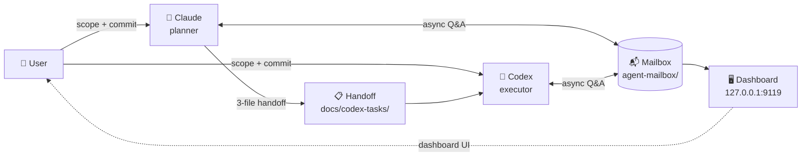

# Workflow — dual-agent development workflow

[English](./README.md) | [Русский](./README.ru.md)

[](https://github.com/ub3dqy/workflow/actions/workflows/ci.yml) [](./dashboard/package.json)

> Two AI agents, one repo. **Claude** plans, **Codex** executes, **you** decide. This repo gives them a shared mailbox, a dashboard to see what's happening, and a rule book that keeps them honest.

---

## 📬 What is this?

A practical workflow для coordinating **two AI coding assistants** (Claude Code + OpenAI Codex CLI) через shared filesystem mailbox. Instead of copy-pasting context between terminals, agents write markdown messages to each other. You stay в the loop через a local dashboard showing pending threads.

**In short**:
- Claude writes plans (`docs/codex-tasks/<slug>.md`)
- Codex reads plan → executes → fills report
- You review diff → commit → push
- Along the way, mailbox captures any back-and-forth (questions, clarifications) without cluttering git history

## 🎯 Why use it?

- **Less copy-paste tax** — agents communicate async через files, not через your clipboard
- **Clear handoffs** — every non-trivial task has a plan + planning-audit + execution report (three-file pattern)
- **You're always the gate** — agents never commit, push, or make scope decisions solo
- **Reproducible** — markdown on disk beats ephemeral chat; any agent joining session reads recent mailbox

## 🖼️ Dashboard preview


*Local dashboard showing pending messages grouped by recipient, with project filter, language toggle (RU/EN), light/dark themes, tab-title badge + favicon для pending count, и audio chime с mute toggle когда приходит новое сообщение.*

---

## ⚡ Quick start

### Requirements

- **Node.js 20.19+** (tested on 20.19, 22.x, 24.x; 18.x technically works but shows install warnings)
- **Windows** or **WSL2 Linux** (launchers Windows-only, CLI/dashboard cross-platform)
- **Git**

### Setup

```bash
git clone https://github.com/ub3dqy/workflow.git
cd workflow/dashboard
npm install
```

### Launch dashboard

**Any platform**:
```bash
cd dashboard
npm run dev
# UI:  http://127.0.0.1:9119
# API: http://127.0.0.1:3003
```

**Windows one-click** (optional):
```
start-workflow.cmd        # starts dashboard, smart npm install caching
stop-workflow.cmd         # releases ports
start-workflow-hidden.vbs # hides console window (shortcut-friendly)
```

### Send a message (CLI)

```bash
# From workflow repo root:
node scripts/mailbox.mjs send \
  --from claude --to codex \
  --thread my-question \
  --body "Нужен clarifying detail по pre-flight step 3"

# Auto-detects project from cwd basename; --project overrides
node scripts/mailbox.mjs list --bucket to-codex
node scripts/mailbox.mjs reply --to to-codex/<filename>.md --body "response"
node scripts/mailbox.mjs archive --path to-claude/<filename>.md --resolution answered
```

See [`local-claude-codex-mailbox-workflow.md`](./local-claude-codex-mailbox-workflow.md) для full protocol.

---

## 🧠 Teaching agents about the mailbox

The dashboard только visualizes — agents need to know mailbox exists и как им пользоваться. Without this step дашборд останется пустым: агенты просто не догадаются проверять и отправлять сообщения. Choose one:

- **Session-start prompt** — подготовьте короткую инструкцию с CLI commands (`send`, `list`, `reply`, `archive`, `recover`) и попросите агента читать её в начале каждой сессии. База: [`local-claude-codex-mailbox-workflow.md`](./local-claude-codex-mailbox-workflow.md).
- **Persistent knowledge base** *(recommended)* — добавьте раздел `agent mail` в свою LLM wiki / memory system. SessionStart hook или context injection подтягивает его в каждую сессию автоматически — агенты проверяют inbox, отвечают и архивируют без ручного напоминания. Такой раздел должен покрывать triggers (`прочитай почту`, `ответь`, `архивируй`), inbox handling default, chat-reporting policy и typовые CLI-паттерны.

---

## 🏗️ Architecture



**Roles** (non-negotiable):

| Who | Does | Doesn't |
|-----|------|---------|
| **Claude** | Plans, reviews, writes docs | Runs production code, commits |
| **Codex** | Executes per plan, fills report | Changes scope, commits/pushes |
| **User** | Approves scope, commits, pushes | Writes code (agents do that) |

**Two communication channels coexist**:

| Channel | Location | Purpose | Git-tracked? |
|---------|----------|---------|--------------|
| **Formal handoff** | `docs/codex-tasks/` | Contracts: plan + planning-audit + report | Yes (immutable history) |
| **Informal mailbox** | `agent-mailbox/` | Async Q&A, clarifications, status updates | No (scratchpad) |

Detailed rules:
- [`CLAUDE.md`](./CLAUDE.md) — project conventions
- [`workflow-instructions-claude.md`](./workflow-instructions-claude.md) — planner role guide
- [`workflow-instructions-codex.md`](./workflow-instructions-codex.md) — executor role guide
- [`workflow-role-distribution.md`](./workflow-role-distribution.md) — role separation rules
- [`local-claude-codex-mailbox-workflow.md`](./local-claude-codex-mailbox-workflow.md) — mailbox protocol spec

---

## 🔒 CI & safety

GitHub Actions (`.github/workflows/ci.yml`) runs on every push/PR:

- **`build`** — `npm ci && npx vite build` (Node 24)
- **`personal-data-check`** — regex scan for accidental PII/hostname leaks

Agents run a matching scan locally before `git push` — catches issues before they hit the public repo.

## 📄 License

[MIT](./LICENSE) © 2026 UB3DQY.

## 🤝 Contributing

Issues и PRs welcome. Workflow expects:

1. Propose scope to maintainer (open an issue first)
2. Follow three-file handoff pattern для non-trivial changes (see `docs/codex-tasks/` examples)
3. Personal data scan clean before push (CI enforces)
4. One logical change per commit

---

*Screenshot captured 2026-04-17; UI may evolve.*
