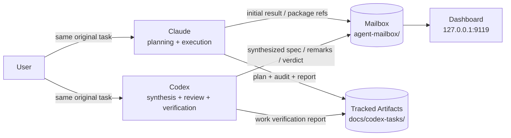

# Workflow — sequential Claude↔Codex development workflow

[English](./README.md) | [Русский](./README.ru.md)

[](https://github.com/ub3dqy/workflow/actions/workflows/ci.yml) [](./dashboard/package.json)

> Two AI agents, one local control plane. **Claude** and **Codex** can now be launched from any project with `clauder` and `codexr`; this repo provides the mailbox transport, wake-up channel, dashboard, and tracked workflow artifacts.

---

## What This Repo Is

This repository documents and implements a sequential two-agent workflow for **Claude Code** and **OpenAI Codex CLI**.

It is also the operator toolkit for running that workflow day to day:

- `clauder` starts Claude Code with mailbox wake-up enabled through a user-scoped `workflow-mailbox` MCP channel.
- `codexr` starts a Codex remote session for the current project and ensures the dashboard backend/app-server are ready.
- `workflow-mailbox*` commands provide the bounded mailbox CLI used by the agents.
- the dashboard shows pending/archived mail, runtime state, Codex transport health, and project filters.

Current contract:

- the same original task is given to both agents
- both agents produce independent initial results
- Codex synthesizes a technical assignment from both results
- Claude builds the tracked planning/execution package and executes only after Codex agreement
- Codex performs final verification and writes the Work Verification Report
- Claude↔Codex coordination happens through `agent-mailbox/`

Canonical workflow source: [docs/codex-system-prompt.md](./docs/codex-system-prompt.md).

## Why Use It

- **Mailbox instead of relay friction**: agent-to-agent coordination is file-based and durable
- **Evidence-first review**: Codex is a real review/verification gate, not a passive executor
- **Tracked implementation package**: live tasks keep a stable tracked artifact set in `docs/codex-tasks/`
- **User stays the decision gate**: commit, push, merge, and design choices still need explicit user approval

## Tracked Artifacts

For a live task, the expected tracked files are:

- `docs/codex-tasks/<slug>.md`
- `docs/codex-tasks/<slug>-planning-audit.md`
- `docs/codex-tasks/<slug>-report.md`
- `docs/codex-tasks/<slug>-work-verification.md`

Important: most existing `docs/codex-tasks/*.md` files are historical archive from earlier workflow revisions. They remain useful as evidence, but they are not the current template unless explicitly marked current.

## Dashboard Preview


*Local dashboard showing project filtering, active-session/runtime state, unclaimed message index, Codex transport health, recipient inboxes, archive controls, language/theme/audio toggles, and pending-count browser indicators. Unread markers are driven by the raw mailbox frontmatter field `received_at`, not by the library's display fallback timestamp.*

---

## Quick Start

### Requirements

- **Node.js 20.19+**
- **Windows** or **WSL2 Linux**
- **Git**

### Install Once

```bash
git clone https://github.com/ub3dqy/workflow.git
cd workflow
cd dashboard
npm install
cd ..
```

Install the launchers once:

```bash
# Windows / Git Bash
install-clauder.cmd

# WSL / Linux
./install-clauder
```

The installer adds `clauder`, `codexr`, and the `workflow-mailbox*` service commands to your user PATH. If the current terminal was already open, run `hash -r` or open a new one.

### Daily Use

Start the dashboard:

```bash
# Windows
start-workflow.cmd

# Or from any shell
cd dashboard
npm run dev
```

Then open agent sessions from the target project directory, usually in separate terminals:

```bash
cd /path/to/your-project
clauder
codexr
```

Local URLs:

```text
Dashboard UI:  http://127.0.0.1:9119
Dashboard API: http://127.0.0.1:3003
Codex bridge:  ws://127.0.0.1:4501
```

Windows helper launchers:

```text
start-workflow.cmd
start-workflow-hidden.vbs
start-workflow-codex.cmd
start-workflow-codex-hidden.vbs
clauder.cmd
codexr.cmd
install-clauder.cmd
start-claude-mailbox.cmd
stop-workflow.cmd
```

### Start Codex Remote Sessions

For Codex mailbox automation, start project sessions through the zero-touch remote launcher instead of raw `codex --remote`:

```bash
codexr
```

`codexr` is the supported operator entry point. It ensures the dashboard backend and Codex app-server are ready, passes `-C "$PWD"`, and sends a short bootstrap prompt so the remote thread has an initial rollout before mailbox delivery starts.

Raw `codex --remote ws://127.0.0.1:4501` is not the supported mailbox entry point: it can create a loaded thread with no rollout, so delivery will remain blocked until a manual first prompt is sent.

The dashboard can start and health-check the Codex transport without owning live remote sessions. Normal Stop/Restart transport calls fail closed so existing `codex --remote` windows stay connected. The separate `Force stop` action is emergency-only and requires typed confirmation.

If `codexr` is not installed on `PATH`, run `install-clauder.cmd` once or use the launcher directly:

```bash
node scripts/codex-remote-project.mjs
```

### Start Claude With Mailbox Wake-Up

Claude Code v2.1.80+ can receive pushed mailbox events through an MCP channel. The `clauder` launcher ensures a user-scoped `workflow-mailbox` MCP server exists, so ordinary projects do not need their own `.mcp.json` just to receive mailbox wake-ups.

Start Claude from the project you want bound to mailbox:

```bash
clauder
```

This is the Claude equivalent of `codexr`: one command opens Claude with mailbox wake-up already enabled. On first run, `clauder` checks/creates the user-scoped MCP server and prints:

```text
[claude-mailbox] user MCP: created
```

Later runs print:

```text
[claude-mailbox] user MCP: existing
```

If `clauder` is not on `PATH` yet, run `install-clauder.cmd` once or use the repo-local fallback:

```text
clauder.cmd
```

The launcher starts Claude from the current project directory with channel `server:workflow-mailbox`, permission mode `auto`, and environment variables that tell the user-scoped MCP server which project slug to poll:

```powershell
claude --dangerously-load-development-channels server:workflow-mailbox --permission-mode auto
```

The first launch asks you to confirm that this is a local development channel. After confirmation, `workflow-mailbox-channel` starts as the `workflow-mailbox` MCP server, polls the central `agent-mailbox/to-claude/` read-only, and pushes pending messages for the current project slug into the live Claude session with `notifications/claude/channel`. Claude still uses the normal mailbox CLI when it actually picks up mail; the channel itself never calls `mailbox.mjs list` and never writes `received_at`.

For another project, just run `clauder` from that project directory. The launcher auto-detects the project slug from existing workflow config if present, otherwise from the folder name with spaces converted to dashes. If you need a specific mailbox slug, pass it explicitly:

```bash
clauder --project other-project
```

Use `bootstrap-workflow.mjs` only when that project also needs persistent Codex hooks or checked-in workflow config.

Quick diagnostics:

```bash
clauder --no-launch
claude mcp get workflow-mailbox
```

If Claude shows `Your account does not have access to Claude Code`, run `/login` in Claude Code and restart `clauder`. If Git Bash cannot find the command after installation, run `hash -r`.

For a trusted local session where permission prompts must be disabled completely, use the explicit bypass mode:

```bash
clauder --mode bypass
```

The recommended mode is `auto`; use `bypass` only in this trusted local workflow repo. The older long `--allowedTools` command is not the zero-touch path because env-prefixed Bash commands can still prompt.

Claude Code v2.1.105+ also supports this repo's older plugin monitor:

```powershell
claude --plugin-dir <repo-root>\claude-workflow-plugin
```

The monitor is read-only and emits a short `WORKFLOW_MAILBOX_PENDING` signal. It is useful as a diagnostic notification path, but idle CLI sessions receive monitor output during an active or next user turn; it is not a guaranteed autonomous wake-up. Use the `workflow-mailbox` channel for push into an already-running session.

### Runtime Doctor

Run the read-only doctor when the dashboard or Codex transport state is unclear:

```bash
node scripts/workflow-doctor.mjs
```

It checks Node, dashboard dependencies, Codex launchers, runtime JSON files, mailbox session binding, and loopback health for `3003`, `9119`, and `4501`. Use `--json` for machine-readable output, `--skip-network` for static checks only, or `--verbose` when full local paths are needed.

### Agent-side mailbox CLI

These commands are for **bound agent sessions**. Agent-path CLI requires explicit `--project` and the current session must already be bound to that project.

```bash
node scripts/mailbox.mjs send \
  --from claude \
  --to codex \
  --thread my-question \
  --project workflow \
  --body "Need clarification on verification step 3"

node scripts/mailbox.mjs list --bucket to-codex --project workflow

node scripts/mailbox.mjs reply \
  --from codex \
  --project workflow \
  --to to-codex/<filename>.md \
  --body "Response"

node scripts/mailbox.mjs archive \
  --path to-claude/<filename>.md \
  --project workflow \
  --resolution no-reply-needed
```

See [local-claude-codex-mailbox-workflow.md](./local-claude-codex-mailbox-workflow.md) for the full protocol.

---

## Architecture



## Roles

| Role | Responsibility | Must not do |
|---|---|---|
| **Claude** | Independent initial result, tracked package creation, execution, git actions on explicit user command | Start execution before Codex agreement, bypass mailbox, invent evidence |
| **Codex** | Independent initial result, synthesis, planning review, final verification, Work Verification Report | Execute implementation, commit/push, approve without checking |
| **User** | Original task, decisions, git authorization | Serve as the required transport layer between agents |

## Current Docs

- [AGENTS.md](./AGENTS.md) — repo-level summary
- [CLAUDE.md](./CLAUDE.md) — project conventions
- [workflow-role-distribution.md](./workflow-role-distribution.md) — durable role split
- [workflow-instructions-claude.md](./workflow-instructions-claude.md) — Claude guide
- [workflow-instructions-codex.md](./workflow-instructions-codex.md) — Codex guide
- [local-claude-codex-mailbox-workflow.md](./local-claude-codex-mailbox-workflow.md) — mailbox protocol
- [docs/mailbox-agent-onboarding.md](./docs/mailbox-agent-onboarding.md) — agent mailbox and Codex remote launch rules
- [docs/bootstrap-kit.md](./docs/bootstrap-kit.md) — dry-run bootstrap checks and minimal config writer for another repo
- [docs/codex-tasks/external-coordinator-vnext/brief.md](./docs/codex-tasks/external-coordinator-vnext/brief.md) — design-only coordinator backlog

## CI And Safety

GitHub Actions runs:

- `build` — dashboard `npm ci`, then `npx vite build`
- `test` — dashboard `npm ci`, then `node --test test/*.test.mjs`
- `workflow doctor` is not part of CI networking, but `test/workflow-doctor.test.mjs` verifies its JSON/static mode
- `personal-data-check` — regex scan for accidental PII and hostname leaks

Before any push, run the same personal-data scan locally.

Local-only runtime state is intentionally excluded from commits:

- `agent-mailbox/` and `mailbox-runtime/` — live mailbox and supervisor state
- `.codex/sessions/` — Codex per-session state
- `.playwright-mcp/` — local Playwright MCP traces

## Contributing

1. Propose scope before meaningful changes.
2. Follow the current contract in `docs/codex-system-prompt.md` and the workflow docs above.
3. Treat older `docs/codex-tasks/*.md` as archive unless explicitly marked current.
4. Keep one logical change per commit.

## License

[MIT](./LICENSE) © 2026 UB3DQY.
