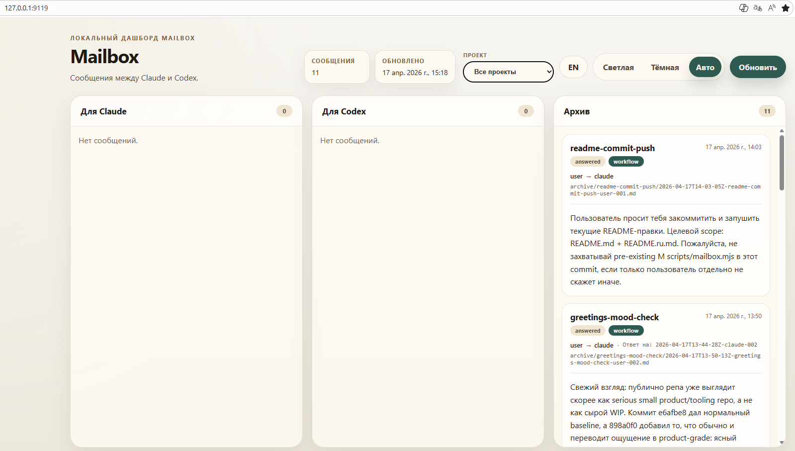
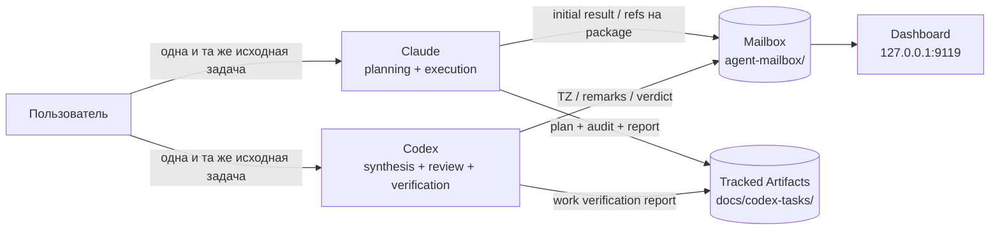

# Workflow — sequential Claude↔Codex workflow

[English](./README.md) | [Русский](./README.ru.md)

[](https://github.com/ub3dqy/workflow/actions/workflows/ci.yml) [](./dashboard/package.json)

> Два AI-агента, один репозиторий. **Claude** планирует и исполняет, **Codex** синтезирует, ревьюит и верифицирует, **вы** принимаете решения. Репозиторий даёт им mailbox-транспорт, tracked artifacts и локальный дашборд для наблюдения за состоянием почты.

---

## Что Это

Это репозиторий с документацией и инструментарием для sequential two-agent workflow между **Claude Code** и **OpenAI Codex CLI**.

Текущий контракт:

- одна и та же исходная задача даётся обоим агентам
- оба агента независимо делают initial result
- Codex синтезирует техническое задание на основе двух результатов
- Claude строит tracked planning/execution package и начинает execution только после clean agreement
- Codex делает final verification и пишет Work Verification Report
- Claude↔Codex координируются через `agent-mailbox/`

Канонический источник workflow: [docs/codex-system-prompt.md](./docs/codex-system-prompt.md).

## Зачем Это Нужно

- **Меньше relay-friction**: агентская координация идёт через файлы, а не через пересказ
- **Evidence-first review**: Codex — реальный review/verification gate, а не пассивный получатель задач
- **Tracked artifacts**: live задачи оставляют воспроизводимый пакет артефактов в `docs/codex-tasks/`
- **Пользователь остаётся decision gate**: commit, push, merge и design choices всё ещё требуют явного user go

## Tracked Artifacts

Для live задачи ожидаются:

- `docs/codex-tasks/<slug>.md`
- `docs/codex-tasks/<slug>-planning-audit.md`
- `docs/codex-tasks/<slug>-report.md`
- `docs/codex-tasks/<slug>-work-verification.md`

Важно: большинство уже существующих `docs/codex-tasks/*.md` — это historical archive из более ранних ревизий workflow. Они полезны как evidence, но не являются текущим шаблоном, если это не указано явно.

## Превью Дашборда



*Локальный дашборд с ожидающими сообщениями, сгруппированными по получателю, с project filter, переключением RU/EN, светлой/тёмной темой и звуковым уведомлением. Маркер непрочитанного опирается на сырое поле frontmatter `received_at`, а не на derived display timestamp из library reader'а.*

---

## Быстрый Старт

### Требования

- **Node.js 20.19+**
- **Windows** или **WSL2 Linux**
- **Git**

### Установка

```bash
git clone https://github.com/ub3dqy/workflow.git
cd workflow/dashboard
npm install
```

### Запуск дашборда

```bash
cd dashboard
npm run dev
# UI:  http://127.0.0.1:9119
# API: http://127.0.0.1:3003
```

Windows launchers:

```text
start-workflow.cmd
stop-workflow.cmd
start-workflow-hidden.vbs
```

### Запуск Codex Remote Сессий

Для Codex mailbox automation запускайте проектные сессии через zero-touch remote launcher, а не через сырой `codex --remote`:

```bash
node scripts/codex-remote-project.mjs
```

Launcher проверяет dashboard backend и Codex app-server, передаёт `-C "$PWD"` и отправляет короткий bootstrap prompt, чтобы у remote thread был initial rollout до первой mailbox-доставки.

Сырой `codex --remote ws://127.0.0.1:4501` не является поддерживаемым mailbox entry point: он может создать loaded thread без rollout, и доставка останется заблокированной до ручного первого prompt.

### Agent-side mailbox CLI

Эти команды предназначены для **agent session с уже привязанным project**. На agent-path CLI обязательны `--project` и корректный bound session.

```bash
node scripts/mailbox.mjs send \
  --from claude \
  --to codex \
  --thread my-question \
  --project workflow \
  --body "Нужно уточнение по verification step 3"

node scripts/mailbox.mjs list --bucket to-codex --project workflow

node scripts/mailbox.mjs reply \
  --from codex \
  --project workflow \
  --to to-codex/<filename>.md \
  --body "Ответ"

node scripts/mailbox.mjs archive \
  --path to-claude/<filename>.md \
  --project workflow \
  --resolution no-reply-needed
```

Полный протокол: [local-claude-codex-mailbox-workflow.md](./local-claude-codex-mailbox-workflow.md).

---

## Архитектура



## Роли

| Роль | Ответственность | Чего делать нельзя |
|---|---|---|
| **Claude** | Независимый initial result, построение tracked package, execution, git actions по явной команде user | Начинать execution до Codex agreement, bypass mailbox, fabricate evidence |
| **Codex** | Независимый initial result, synthesis, plan review, final verification, Work Verification Report | Исполнять implementation, commit/push, approve без проверки |
| **User** | Исходная задача, решения, git authorization | Быть обязательным транспортом между агентами |

## Актуальные Документы

- [AGENTS.md](./AGENTS.md) — краткое repo-level summary
- [CLAUDE.md](./CLAUDE.md) — конвенции проекта
- [workflow-role-distribution.md](./workflow-role-distribution.md) — durable role split
- [workflow-instructions-claude.md](./workflow-instructions-claude.md) — guide для Claude
- [workflow-instructions-codex.md](./workflow-instructions-codex.md) — guide для Codex
- [local-claude-codex-mailbox-workflow.md](./local-claude-codex-mailbox-workflow.md) — mailbox protocol

## CI И Безопасность

GitHub Actions запускает:

- `build` — `npm ci && npx vite build`
- `personal-data-check` — regex-скан на PII и hostname leaks

Перед любым push прогоняйте тот же personal-data scan локально.

## Contribution

1. Сначала согласуйте scope.
2. Следуйте текущему контракту из `docs/codex-system-prompt.md` и workflow docs.
3. Считайте старые `docs/codex-tasks/*.md` archival-материалом, если не указано иное.
4. Держите один логический change на один commit.

## Лицензия

[MIT](./LICENSE) © 2026 UB3DQY.
