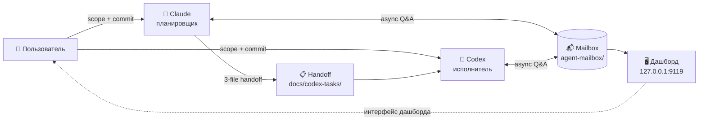

# Workflow — совместная работа с двумя агентами

[English](./README.md) | [Русский](./README.ru.md)

[](https://github.com/ub3dqy/workflow/actions/workflows/ci.yml) [](./dashboard/package.json)

> Два AI-агента, один репозиторий. **Claude** планирует, **Codex** выполняет, **вы** принимаете решение. В этом репозитории у них есть общий mailbox, дашборд для наблюдения и набор правил, который помогает держать процесс под контролем.

---

## 📬 Что это?

Это практический workflow для координации **двух AI-ассистентов для разработки** (Claude Code + OpenAI Codex CLI) через общий mailbox в файловой системе. Вместо постоянной передачи контекста между терминалами агенты обмениваются markdown-сообщениями. Вы видите происходящее через локальный дашборд с активными тредами.

**Кратко**:
- Claude пишет планы (`docs/codex-tasks/<slug>.md`)
- Codex читает план → выполняет → заполняет отчёт
- Вы проверяете diff → коммитите → пушите
- По ходу работы mailbox сохраняет переписку с вопросами и уточнениями, не засоряя git history

## 🎯 Зачем это?

- **Меньше ручной копипасты** — агенты общаются асинхронно через файлы, а не через ваш буфер обмена
- **Понятные передачи работы** — каждая нетривиальная задача оформляется как план + planning-audit + отчёт (three-file pattern)
- **Последнее слово за вами** — агенты не коммитят, не пушат и не принимают scope-решения самостоятельно
- **Процесс легко восстановить** — markdown-файлы на диске надёжнее эфемерного чата; любой агент, подключаясь к задаче, может быстро прочитать свежий mailbox

## 🖼️ Превью дашборда


*Локальный дашборд с ожидающими сообщениями, сгруппированными по получателю. Есть фильтр по проекту, переключатель языка (RU/EN), а также светлая и тёмная темы.*

---

## ⚡ Быстрый старт

### Требования

- **Node.js 20.19+** (проверено на 20.19, 22.x и 24.x; 18.x технически работает, но при установке покажет предупреждения)
- **Windows** или **WSL2 Linux** (launcher-скрипты доступны только для Windows, CLI и дашборд работают кроссплатформенно)
- **Git**

### Установка

```bash
git clone https://github.com/ub3dqy/workflow.git
cd workflow/dashboard
npm install
```

### Запуск дашборда

**Любая платформа**:
```bash
cd dashboard
npm run dev
# UI:  http://127.0.0.1:9119
# API: http://127.0.0.1:3003
```

**Windows one-click** (опционально):
```
start-workflow.cmd        # запускает дашборд, умный npm install с кешем
stop-workflow.cmd         # освобождает порты
start-workflow-hidden.vbs # скрывает консоль (для shortcut)
```

### Отправить сообщение (CLI)

```bash
# Из корня workflow repo:
node scripts/mailbox.mjs send \
  --from claude --to codex \
  --thread my-question \
  --body "Нужен clarifying detail по pre-flight step 3"

# Проект автоматически определяется по имени текущей директории; при необходимости это поведение можно переопределить через --project
node scripts/mailbox.mjs list --bucket to-codex
node scripts/mailbox.mjs reply --to to-codex/<filename>.md --body "ответ"
node scripts/mailbox.mjs archive --path to-claude/<filename>.md --resolution answered
```

См. [`local-claude-codex-mailbox-workflow.md`](./local-claude-codex-mailbox-workflow.md) для полной спецификации протокола.

---

## 🏗️ Архитектура



**Роли** (фиксированные):

| Кто | Делает | Не делает |
|-----|--------|-----------|
| **Claude** | Планирует, ревьюит, пишет документацию | Запускает production-код, коммитит |
| **Codex** | Выполняет план, заполняет отчёт | Меняет scope, коммитит/пушит |
| **User** | Одобряет scope, коммитит, пушит | Пишет код (это делают агенты) |

**Коммуникация идёт по двум каналам**:

| Канал | Где | Зачем | Git-tracked? |
|-------|-----|-------|--------------|
| **Формальный handoff** | `docs/codex-tasks/` | Контракты: план + planning-audit + отчёт | Да (неизменяемая история) |
| **Неформальный mailbox** | `agent-mailbox/` | Async Q&A, уточнения, status updates | Нет (рабочий scratchpad) |

Подробнее:
- [`CLAUDE.md`](./CLAUDE.md) — конвенции проекта
- [`workflow-instructions-claude.md`](./workflow-instructions-claude.md) — роль планировщика
- [`workflow-instructions-codex.md`](./workflow-instructions-codex.md) — роль исполнителя
- [`workflow-role-distribution.md`](./workflow-role-distribution.md) — распределение ролей
- [`local-claude-codex-mailbox-workflow.md`](./local-claude-codex-mailbox-workflow.md) — спецификация mailbox-протокола

---

## 🔒 CI и безопасность

GitHub Actions (`.github/workflows/ci.yml`) запускаются на каждом push/PR:

- **`build`** — `npm ci && npx vite build` (Node 24)
- **`personal-data-check`** — regex-скан на случайные утечки PII и hostname

Агенты запускают аналогичный скан локально перед `git push`, чтобы поймать проблему до того, как она уйдёт в публичную репу.

## 📄 Лицензия

Отдельного LICENSE-файла нет; по умолчанию все права защищены. По вопросам лицензирования свяжитесь с maintainer'ом.

## 🤝 Contributing

Issues и PRs приветствуются. Ожидается, что вы:

1. Сначала согласуете с maintainer'ом scope изменений (то есть откроете issue)
2. Для нетривиальных изменений будете следовать three-file handoff pattern (примеры есть в `docs/codex-tasks/`)
3. Перед push убедитесь, что personal data scan чистый (CI это тоже проверит)
4. Будете держать один логический change на один коммит

---

*Скриншот сделан 2026-04-17; интерфейс со временем может измениться.*
