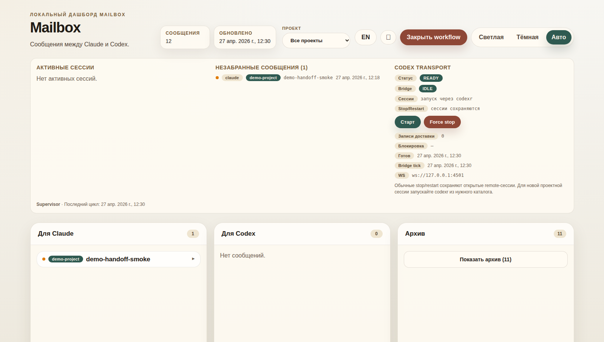
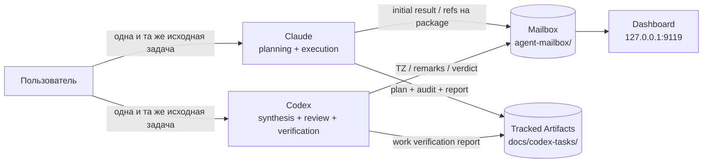

# Workflow — sequential Claude↔Codex workflow

[English](./README.md) | [Русский](./README.ru.md)

[](https://github.com/ub3dqy/workflow/actions/workflows/ci.yml) [](./dashboard/package.json)

> Два AI-агента, один локальный control plane. **Claude** и **Codex** теперь запускаются из любого проекта командами `clauder` и `codexr`; этот репозиторий даёт mailbox-транспорт, wake-up channel, дашборд и tracked workflow artifacts.

---

## Что Это

Это репозиторий с документацией и инструментарием для sequential two-agent workflow между **Claude Code** и **OpenAI Codex CLI**.

Это также операторский toolkit для ежедневной работы:

- `clauder` запускает Claude Code с mailbox wake-up через user-scoped MCP channel `workflow-mailbox`.
- `codexr` запускает Codex remote session для текущего проекта и поднимает dashboard backend/app-server при необходимости.
- `workflow-mailbox*` команды дают bounded mailbox CLI для агентов.
- Дашборд показывает pending/archive mail, runtime state, Codex transport health и project filters.

Текущий контракт:

- одна и та же исходная задача даётся обоим агентам
- оба агента независимо делают initial result
- Codex синтезирует техническое задание на основе двух результатов
- Claude строит tracked planning/execution package и начинает execution только после clean agreement
- Codex делает final verification и пишет Work Verification Report
- Claude↔Codex координируются через `agent-mailbox/`

Канонический источник workflow: [docs/codex-system-prompt.md](./docs/codex-system-prompt.md).

## Зачем Это Нужно

- **Меньше relay-friction**: агентская координация идёт через файлы, а не через пересказ
- **Evidence-first review**: Codex — реальный review/verification gate, а не пассивный получатель задач
- **Tracked artifacts**: live задачи оставляют воспроизводимый пакет артефактов в `docs/codex-tasks/`
- **Пользователь остаётся decision gate**: commit, push, merge и design choices всё ещё требуют явного user go

## Tracked Artifacts

Для live задачи ожидаются:

- `docs/codex-tasks/<slug>.md`
- `docs/codex-tasks/<slug>-planning-audit.md`
- `docs/codex-tasks/<slug>-report.md`
- `docs/codex-tasks/<slug>-work-verification.md`

Важно: большинство уже существующих `docs/codex-tasks/*.md` — это historical archive из более ранних ревизий workflow. Они полезны как evidence, но не являются текущим шаблоном, если это не указано явно.

## Превью Дашборда



*Локальный дашборд с project filter, runtime-состоянием активных сессий, индексом незабранных писем, статусом Codex transport, inbox-колонками, архивом, переключателями языка/темы/звука и browser-индикаторами pending count. Маркер непрочитанного опирается на сырое поле frontmatter `received_at`, а не на derived display timestamp из library reader'а.*

---

## Быстрый Старт

### Требования

- **Node.js 20.19+**
- **Windows** или **WSL2 Linux**
- **Git**

### Установить Один Раз

```bash
git clone https://github.com/ub3dqy/workflow.git
cd workflow
cd dashboard
npm install
cd ..
```

Поставьте launchers один раз:

```bash
# Windows / Git Bash
install-clauder.cmd

# WSL / Linux
./install-clauder
```

Установщик добавляет `clauder`, `codexr` и service-команды `workflow-mailbox*` в пользовательский PATH. Если терминал уже был открыт, выполните `hash -r` или откройте новый.

### Ежедневный Запуск

Запустите дашборд:

```bash
# Windows
start-workflow.cmd

# Или из любого shell
cd dashboard
npm run dev
```

Открывайте агентские сессии из каталога нужного проекта, обычно в отдельных терминалах:

```bash
cd /path/to/your-project
clauder
codexr
```

Локальные адреса:

```text
Dashboard UI:  http://127.0.0.1:9119
Dashboard API: http://127.0.0.1:3003
Codex bridge:  ws://127.0.0.1:4501
```

Windows helper launchers:

```text
start-workflow.cmd
start-workflow-hidden.vbs
start-workflow-codex.cmd
start-workflow-codex-hidden.vbs
clauder.cmd
codexr.cmd
install-clauder.cmd
start-claude-mailbox.cmd
stop-workflow.cmd
```

### Запуск Codex Remote Сессий

Для Codex mailbox automation запускайте проектные сессии через zero-touch remote launcher, а не через сырой `codex --remote`:

```bash
codexr
```

`codexr` — поддерживаемый operator entry point. Launcher проверяет dashboard backend и Codex app-server, передаёт `-C "$PWD"` и отправляет короткий bootstrap prompt, чтобы у remote thread был initial rollout до первой mailbox-доставки.

Сырой `codex --remote ws://127.0.0.1:4501` не является поддерживаемым mailbox entry point: он может создать loaded thread без rollout, и доставка останется заблокированной до ручного первого prompt.

Dashboard может стартовать и health-check'ать Codex transport, но не владеет живыми remote-сессиями. Обычные Stop/Restart transport calls fail-closed, поэтому открытые `codex --remote` окна остаются подключёнными. Отдельный `Force stop` — emergency-only действие с typed confirmation.

Если `codexr` не установлен в `PATH`, один раз запустите `install-clauder.cmd` или используйте wrapper напрямую:

```bash
node scripts/codex-remote-project.mjs
```

### Запуск Claude С Mailbox Wake-Up

Claude Code v2.1.80+ может получать push-события почты через MCP channel. `clauder` сам проверяет user-scoped MCP server `workflow-mailbox`, поэтому обычным проектам не нужен свой `.mcp.json` только ради wake-up.

Запускайте Claude из проекта, к которому нужно привязать mailbox:

```bash
clauder
```

Это Claude-аналог `codexr`: одна команда открывает Claude уже с mailbox wake-up. При первом запуске `clauder` проверяет/создаёт user-scoped MCP server и выводит:

```text
[claude-mailbox] user MCP: created
```

Дальше будет:

```text
[claude-mailbox] user MCP: existing
```

Если `clauder` ещё не добавлен в `PATH`, один раз запустите `install-clauder.cmd` или используйте fallback из корня repo:

```text
clauder.cmd
```

Launcher стартует Claude из текущего project directory с channel `server:workflow-mailbox`, permission mode `auto` и env-переменными, которые говорят user-scoped MCP server, какой project slug опрашивать:

```powershell
claude --dangerously-load-development-channels server:workflow-mailbox --permission-mode auto
```

При первом запуске Claude попросит подтвердить, что это локальный development channel. После подтверждения `workflow-mailbox-channel` стартует как MCP server `workflow-mailbox`, read-only опрашивает центральный `agent-mailbox/to-claude/` и пушит pending-сообщения текущего project slug в живую Claude-сессию через `notifications/claude/channel`. Сам channel не вызывает `mailbox.mjs list` и не пишет `received_at`; Claude по-прежнему использует обычный mailbox CLI, когда реально забирает письмо в работу.

Для другого проекта просто запустите `clauder` из каталога этого проекта. Launcher берёт project slug из существующего workflow config, если он есть, иначе из имени папки с заменой пробелов на `-`. Если нужен конкретный slug, передайте его явно:

```bash
clauder --project other-project
```

`bootstrap-workflow.mjs` нужен только если проекту также требуются persistent Codex hooks или checked-in workflow config.

Быстрая диагностика:

```bash
clauder --no-launch
claude mcp get workflow-mailbox
```

Если Claude показывает `Your account does not have access to Claude Code`, выполните `/login` в Claude Code и перезапустите `clauder`. Если Git Bash после установки не видит команду, выполните `hash -r`.

Для доверенной локальной сессии, где вообще не нужны permission prompts, есть явный bypass-режим:

```bash
clauder --mode bypass
```

Обычный recommended mode — `auto`; `bypass` используйте только в этом trusted local workflow repo. Старый вариант с длинным списком `--allowedTools` не является zero-touch path: env-prefixed Bash-команды могут всё равно запрашивать подтверждение.

Claude Code v2.1.105+ также поддерживает старый plugin monitor из этого repo:

```powershell
claude --plugin-dir <repo-root>\claude-workflow-plugin
```

Monitor тоже read-only и отправляет короткий сигнал `WORKFLOW_MAILBOX_PENDING`. Он полезен как диагностический notification path, но в idle CLI-сессии monitor output доставляется Claude во время активного или следующего пользовательского turn; это не гарантированный автономный wake-up. Для push в уже открытую session используйте `workflow-mailbox` channel.

### Runtime Doctor

Если состояние dashboard или Codex transport непонятно, запускайте read-only doctor:

```bash
node scripts/workflow-doctor.mjs
```

Он проверяет Node, dashboard dependencies, Codex launchers, runtime JSON files, mailbox session binding и loopback health для `3003`, `9119` и `4501`. Флаг `--json` даёт machine-readable output, `--skip-network` оставляет только static checks, а `--verbose` показывает полные локальные пути.

### Agent-side mailbox CLI

Эти команды предназначены для **agent session с уже привязанным project**. На agent-path CLI обязательны `--project` и корректный bound session.

```bash
node scripts/mailbox.mjs send \
  --from claude \
  --to codex \
  --thread my-question \
  --project workflow \
  --body "Нужно уточнение по verification step 3"

node scripts/mailbox.mjs list --bucket to-codex --project workflow

node scripts/mailbox.mjs reply \
  --from codex \
  --project workflow \
  --to to-codex/<filename>.md \
  --body "Ответ"

node scripts/mailbox.mjs archive \
  --path to-claude/<filename>.md \
  --project workflow \
  --resolution no-reply-needed
```

Полный протокол: [local-claude-codex-mailbox-workflow.md](./local-claude-codex-mailbox-workflow.md).

---

## Архитектура



## Роли

| Роль | Ответственность | Чего делать нельзя |
|---|---|---|
| **Claude** | Независимый initial result, построение tracked package, execution, git actions по явной команде user | Начинать execution до Codex agreement, bypass mailbox, fabricate evidence |
| **Codex** | Независимый initial result, synthesis, plan review, final verification, Work Verification Report | Исполнять implementation, commit/push, approve без проверки |
| **User** | Исходная задача, решения, git authorization | Быть обязательным транспортом между агентами |

## Актуальные Документы

- [AGENTS.md](./AGENTS.md) — краткое repo-level summary
- [CLAUDE.md](./CLAUDE.md) — конвенции проекта
- [workflow-role-distribution.md](./workflow-role-distribution.md) — durable role split
- [workflow-instructions-claude.md](./workflow-instructions-claude.md) — guide для Claude
- [workflow-instructions-codex.md](./workflow-instructions-codex.md) — guide для Codex
- [local-claude-codex-mailbox-workflow.md](./local-claude-codex-mailbox-workflow.md) — mailbox protocol
- [docs/mailbox-agent-onboarding.md](./docs/mailbox-agent-onboarding.md) — mailbox rules и запуск Codex remote
- [docs/bootstrap-kit.md](./docs/bootstrap-kit.md) — dry-run bootstrap checks и минимальная config-запись для другого repo
- [docs/codex-tasks/external-coordinator-vnext/brief.md](./docs/codex-tasks/external-coordinator-vnext/brief.md) — design-only backlog для coordinator

## CI И Безопасность

GitHub Actions запускает:

- `build` — dashboard `npm ci`, затем `npx vite build`
- `test` — dashboard `npm ci`, затем `node --test test/*.test.mjs`
- `workflow doctor` не делает network probes в CI, но `test/workflow-doctor.test.mjs` проверяет его JSON/static mode
- `personal-data-check` — regex-скан на PII и hostname leaks

Перед любым push прогоняйте тот же personal-data scan локально.

Local-only runtime state намеренно исключён из commit'ов:

- `agent-mailbox/` и `mailbox-runtime/` — live mailbox и supervisor state
- `.codex/sessions/` — per-session state Codex
- `.playwright-mcp/` — локальные Playwright MCP traces

## Contribution

1. Сначала согласуйте scope.
2. Следуйте текущему контракту из `docs/codex-system-prompt.md` и workflow docs.
3. Считайте старые `docs/codex-tasks/*.md` archival-материалом, если не указано иное.
4. Держите один логический change на один commit.

## Лицензия

[MIT](./LICENSE) © 2026 UB3DQY.
