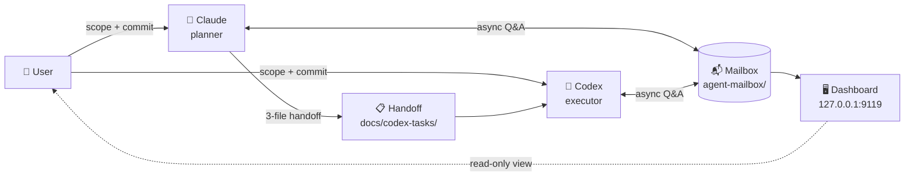
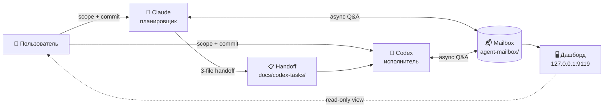

# README Bilingual + Friendly Redesign — Execution Plan

**Version**: v1 (2026-04-17)
**Planning-audit**: `docs/codex-tasks/readme-bilingual-friendly-redesign-planning-audit.md`

---

## Why this plan exists

User request после shipping "готовый продукт" commit `e6afbe8`:
> сделай вариант 1 [EN + RU с cross-links] и можно редми сделать чуть поживее добавить картинок повеселее и сделать более дружелюбным вначале четко указать что это и зачем нужно

Scope: rewrite `README.md` с friendlier tone + screenshots + clear "what/why" opening; create `README.ru.md` Russian counterpart; cross-link headers; add screenshots к `docs/assets/`. Docs-only; zero functional code changes.

---

## Иерархия источников правды

1. GFM spec via context7 — markdown syntax
2. Current `README.md` (113 lines) — baseline content map
3. Fresh dashboard screenshots (2026-04-17) — visual artifacts
4. This plan — third truth
5. Discrepancy-first

---

## Doc Verification

### §V1 — GFM image syntax

**Source**: `https://github.github.com/gfm/index` (via context7 `/websites/github_github_gfm`)
**Verbatim**: *"Syntax for images is like the syntax for links, with one difference. Instead of link text, we have an image description... An image description starts with `` works, relative paths OK, alt text = accessibility.

### §V2 — Mermaid rendering в GitHub README

**Source**: GitHub blog 2022-02-14 "Include diagrams in your Markdown files with Mermaid" (widely documented, `[PROJECT]` reference — не freshly fetched). Codex optional fetch if skeptical.

**Behavior**: fenced block `` ```mermaid `` + mermaid syntax inside → GitHub renders inline на GitHub.com (not rendered on most other markdown viewers — acceptable fallback).

---

## Pre-flight

1. **Environment**: `uname -a && node --version && pwd`
2. **HEAD**: `git log --oneline -1`. Planning snapshot `e6afbe8`. Drift → record.
3. **Working tree**: `git status --short`. Expected baseline на 2026-04-17 (может drift — fresh probe authoritative):
   - `M scripts/mailbox.mjs` — **pre-existing**, out-of-scope preserved per Whitelist "НЕ трогать"
   - `?? docs/assets/` — Claude's planning-phase screenshots (будут staged via Change 3)
   - `?? docs/codex-tasks/readme-bilingual-friendly-redesign{,-planning-audit,-report}.md` — этот handoff
   - `.codex` NOT visible (already gitignored via prior handoff `e6afbe8`)
   
   Record observed, не STOP на pre-existing state. STOP только если unexpected production mods beyond `scripts/mailbox.mjs`.
4. **README.md baseline exists**: `test -f README.md && wc -l README.md`. Expected: 113 lines (from commit e6afbe8).
5. **Screenshots exist**: `ls -la docs/assets/dashboard-overview.png docs/assets/dashboard-full.png`. Expected: 2 files, both PNG, ~150KB + ~270KB.
6. **WORKFLOW_ROOT probe**:
   ```bash
   ls /mnt/e/project/workflow 2>&1 | head -3
   ls /mnt/e/Project/workflow 2>&1 | head -3
   ```

STOP only на unexpected production mods или missing screenshots.

---

## Whitelist

### Create

| # | Path | Description |
|---|------|-------------|
| W1 | `README.ru.md` (repo root) | New Russian README, mirror structure of English |

### Modify

| # | Path | What |
|---|------|------|
| W2 | `README.md` | Rewrite: friendlier opening, screenshots, mermaid architecture diagram, cross-link header к RU, moderate emoji |

### Track (already in docs/assets/ from planning, need git add)

| # | Path | What |
|---|------|------|
| W3 | `docs/assets/dashboard-overview.png` | Screenshot (154KB) — primary README visual |
| W4 | `docs/assets/dashboard-full.png` | Screenshot (268KB) — supplementary full-page reference |

### НЕ трогать

- Production code: `scripts/*`, `dashboard/**` except `package.json` (if engines needs bump, out of scope)
- Existing docs referenced by README: `CLAUDE.md`, `workflow-*.md`, `local-*.md` — unchanged
- `.gitignore`, launchers — unchanged
- Historical handoff artifacts в `docs/codex-tasks/*` — immutable

---

## Changes

### Change 1 — Rewrite `README.md` (English)

**File**: `README.md` at repo root.

**Target structure** (rewrite, ~180-230 lines):

```markdown
# Workflow — dual-agent development workflow

[English](./README.md) | [Русский](./README.ru.md)

[](https://github.com/ub3dqy/workflow/actions/workflows/ci.yml) [](./dashboard/package.json)

> Two AI agents, one repo. **Claude** plans, **Codex** executes, **you** decide. This repo gives them a shared mailbox, a dashboard to see what's happening, and a rule book that keeps them honest.

---

## 📬 What is this?

A practical workflow для coordinating **two AI coding assistants** (Claude Code + OpenAI Codex CLI) через shared filesystem mailbox. Instead of copy-pasting context between terminals, agents write markdown messages to each other. You stay в the loop через a local dashboard showing pending threads.

**In short**:
- Claude writes plans (`docs/codex-tasks/<slug>.md`)
- Codex reads plan → executes → fills report
- You review diff → commit → push
- Along the way, mailbox captures any back-and-forth (questions, clarifications) without cluttering git history

## 🎯 Why use it?

- **Less copy-paste tax** — agents communicate async через files, not через your clipboard
- **Clear handoffs** — every non-trivial task has a plan + planning-audit + execution report (three-file pattern)
- **You're always the gate** — agents never commit, push, or make scope decisions solo
- **Reproducible** — markdown on disk beats ephemeral chat; any agent joining session reads recent mailbox

## 🖼️ Dashboard preview


*Local read-only dashboard showing pending messages grouped by recipient, with project filter, language toggle (RU/EN), and light/dark themes.*

---

## ⚡ Quick start

### Requirements

- **Node.js 20.19+** (tested on 20.19, 22.x, 24.x; 18.x technically works but shows install warnings)
- **Windows** or **WSL2 Linux** (launchers Windows-only, CLI/dashboard cross-platform)
- **Git**

### Setup

```bash
git clone https://github.com/ub3dqy/workflow.git
cd workflow/dashboard
npm install
```

### Launch dashboard

**Any platform**:
```bash
cd dashboard
npm run dev
# UI:  http://127.0.0.1:9119
# API: http://127.0.0.1:3003
```

**Windows one-click** (optional):
```
start-workflow.cmd        # starts dashboard, smart npm install caching
stop-workflow.cmd         # releases ports
start-workflow-hidden.vbs # hides console window (shortcut-friendly)
```

### Send a message (CLI)

```bash
# From workflow repo root:
node scripts/mailbox.mjs send \
  --from claude --to codex \
  --thread my-question \
  --body "Нужен clarifying detail по pre-flight step 3"

# Auto-detects project from cwd basename; --project overrides
node scripts/mailbox.mjs list --bucket to-codex
node scripts/mailbox.mjs reply --to to-codex/<filename>.md --body "response"
node scripts/mailbox.mjs archive --path to-claude/<filename>.md --resolution answered
```

See [`local-claude-codex-mailbox-workflow.md`](./local-claude-codex-mailbox-workflow.md) для full protocol.

---

## 🏗️ Architecture



**Roles** (non-negotiable):

| Who | Does | Doesn't |
|-----|------|---------|
| **Claude** | Plans, reviews, writes docs | Runs production code, commits |
| **Codex** | Executes per plan, fills report | Changes scope, commits/pushes |
| **User** | Approves scope, commits, pushes | Writes code (agents do that) |

**Two communication channels coexist**:

| Channel | Location | Purpose | Git-tracked? |
|---------|----------|---------|--------------|
| **Formal handoff** | `docs/codex-tasks/` | Contracts: plan + planning-audit + report | Yes (immutable history) |
| **Informal mailbox** | `agent-mailbox/` | Async Q&A, clarifications, status updates | No (scratchpad) |

Detailed rules:
- [`CLAUDE.md`](./CLAUDE.md) — project conventions
- [`workflow-instructions-claude.md`](./workflow-instructions-claude.md) — planner role guide
- [`workflow-instructions-codex.md`](./workflow-instructions-codex.md) — executor role guide
- [`workflow-role-distribution.md`](./workflow-role-distribution.md) — role separation rules
- [`local-claude-codex-mailbox-workflow.md`](./local-claude-codex-mailbox-workflow.md) — mailbox protocol spec

---

## 🔒 CI & safety

GitHub Actions (`.github/workflows/ci.yml`) runs on every push/PR:

- **`build`** — `npm ci && npx vite build` (Node 24)
- **`personal-data-check`** — regex scan for accidental PII/hostname leaks

Agents run a matching scan locally before `git push` — catches issues before they hit the public repo.

## 📄 License

No explicit license file; all rights reserved by default. Contact maintainer для licensing questions.

## 🤝 Contributing

Issues и PRs welcome. Workflow expects:

1. Propose scope to maintainer (open an issue first)
2. Follow three-file handoff pattern для non-trivial changes (see `docs/codex-tasks/` examples)
3. Personal data scan clean before push (CI enforces)
4. One logical change per commit

---

*Screenshot captured 2026-04-17; UI may evolve.*
```

**Rationale**:
- Opening tagline + cross-link header + 2 badges — dense but approachable
- "What is this?" + "Why use it?" answer user's directive clearly
- Screenshot right after opening — visual engagement
- Quick start separated from architecture — scannable
- Mermaid flowchart — modern GFM feature, renders natively on GitHub
- Roles + channels tables — dense information, easy to scan
- Emoji moderate (section headers only, 7 total) — approachable без being childish

### Change 2 — Create `README.ru.md` (Russian)

**File**: `README.ru.md` at repo root.

**Target structure** (mirror of English, localized):

```markdown
# Workflow — dual-agent development workflow

[English](./README.md) | [Русский](./README.ru.md)

[](https://github.com/ub3dqy/workflow/actions/workflows/ci.yml) [](./dashboard/package.json)

> Два AI-агента, один репозиторий. **Claude** планирует, **Codex** выполняет, **вы** решаете. Репа даёт им общий почтовый ящик, дашборд для наблюдения и свод правил, который держит их в рамках.

---

## 📬 Что это?

Рабочий процесс для координации **двух AI-ассистентов для кода** (Claude Code + OpenAI Codex CLI) через shared filesystem mailbox. Вместо копипасты контекста между терминалами, агенты пишут markdown-сообщения друг другу. Вы остаётесь в курсе через локальный дашборд, который показывает ожидающие треды.

**Кратко**:
- Claude пишет планы (`docs/codex-tasks/<slug>.md`)
- Codex читает план → выполняет → заполняет отчёт
- Вы проверяете diff → коммитите → пушите
- По пути mailbox ловит переписку (вопросы, уточнения), не засоряя git history

## 🎯 Зачем это?

- **Меньше налога на copy-paste** — агенты общаются async через файлы, не через ваш буфер обмена
- **Чёткие передачи** — каждая нетривиальная задача = план + planning-audit + отчёт (three-file pattern)
- **Вы всегда ворота** — агенты никогда не коммитят, не пушат, не принимают scope-решения в одиночку
- **Воспроизводимо** — markdown на диске лучше эфемерного чата; любой агент, подключаясь, читает свежий mailbox

## 🖼️ Превью дашборда


*Локальный read-only дашборд с ожидающими сообщениями, сгруппированными по получателю. Есть фильтр по проекту, переключатель языка (RU/EN), светлая/тёмная тема.*

---

## ⚡ Быстрый старт

### Требования

- **Node.js 20.19+** (протестировано 20.19, 22.x, 24.x; 18.x технически работает, но покажет install warnings)
- **Windows** или **WSL2 Linux** (launchers Windows-only, CLI/дашборд cross-platform)
- **Git**

### Установка

```bash
git clone https://github.com/ub3dqy/workflow.git
cd workflow/dashboard
npm install
```

### Запуск дашборда

**Любая платформа**:
```bash
cd dashboard
npm run dev
# UI:  http://127.0.0.1:9119
# API: http://127.0.0.1:3003
```

**Windows one-click** (опционально):
```
start-workflow.cmd        # запускает дашборд, умный npm install с кешем
stop-workflow.cmd         # освобождает порты
start-workflow-hidden.vbs # скрывает консоль (для shortcut)
```

### Отправить сообщение (CLI)

```bash
# Из корня workflow repo:
node scripts/mailbox.mjs send \
  --from claude --to codex \
  --thread my-question \
  --body "Нужен clarifying detail по pre-flight step 3"

# Auto-detect проекта из basename(cwd); --project переопределяет
node scripts/mailbox.mjs list --bucket to-codex
node scripts/mailbox.mjs reply --to to-codex/<filename>.md --body "ответ"
node scripts/mailbox.mjs archive --path to-claude/<filename>.md --resolution answered
```

См. [`local-claude-codex-mailbox-workflow.md`](./local-claude-codex-mailbox-workflow.md) для полной спецификации протокола.

---

## 🏗️ Архитектура



**Роли** (non-negotiable):

| Кто | Делает | Не делает |
|-----|--------|-----------|
| **Claude** | Планирует, ревьюит, пишет докуменацию | Запускает production код, коммитит |
| **Codex** | Выполняет по плану, заполняет отчёт | Меняет scope, коммитит/пушит |
| **User** | Одобряет scope, коммитит, пушит | Пишет код (это делают агенты) |

**Два канала коммуникации сосуществуют**:

| Канал | Где | Зачем | Git-tracked? |
|-------|-----|-------|--------------|
| **Формальный handoff** | `docs/codex-tasks/` | Контракты: план + planning-audit + отчёт | Да (immutable история) |
| **Неформальный mailbox** | `agent-mailbox/` | Async Q&A, уточнения, status updates | Нет (scratchpad) |

Подробные правила:
- [`CLAUDE.md`](./CLAUDE.md) — конвенции проекта
- [`workflow-instructions-claude.md`](./workflow-instructions-claude.md) — роль планировщика
- [`workflow-instructions-codex.md`](./workflow-instructions-codex.md) — роль исполнителя
- [`workflow-role-distribution.md`](./workflow-role-distribution.md) — распределение ролей
- [`local-claude-codex-mailbox-workflow.md`](./local-claude-codex-mailbox-workflow.md) — спецификация mailbox-протокола

---

## 🔒 CI и безопасность

GitHub Actions (`.github/workflows/ci.yml`) запускаются на каждом push/PR:

- **`build`** — `npm ci && npx vite build` (Node 24)
- **`personal-data-check`** — regex-скан на случайные PII/hostname leaks

Агенты запускают аналогичный скан локально перед `git push` — ловит проблемы до того как они уйдут в публичную репу.

## 📄 Лицензия

Отдельного LICENSE файла нет; все права зарезервированы по умолчанию. Для licensing-вопросов свяжитесь с maintainer'ом.

## 🤝 Contributing

Issues и PRs приветствуются. Workflow ожидает:

1. Предложить scope maintainer'у (сначала открыть issue)
2. Следовать three-file handoff pattern для нетривиальных изменений (примеры в `docs/codex-tasks/`)
3. Personal data scan чистый перед push (CI проверит)
4. Один логический change на коммит

---

*Скриншот сделан 2026-04-17; UI может измениться.*
```

**Rationale**: structural mirror of English, natural Russian (not literal translation), same sections, same emoji/badges, cross-link к English version. Term preservation: technical terms (CLI, API, commit, handoff, Mermaid) stay in English где это industry standard.

### Change 3 — Track screenshots

**Files**: `docs/assets/dashboard-overview.png` + `docs/assets/dashboard-full.png` (already exist on disk от planning-phase capture).

**Action**: `git add docs/assets/dashboard-overview.png docs/assets/dashboard-full.png`.

**Content unchanged**: files уже saved Claude's planning phase Playwright run; Codex just stages them.

---

## Verification phases

### Phase 1 — Codex self-check

| # | Test | Expected |
|---|------|----------|
| V1 | `README.md` rewritten, length 140-200 | `wc -l README.md` → 140-200 |
| V2 | README header cross-link к RU | `grep -c "README.ru.md" README.md` → ≥1 |
| V3 | README image reference valid | `grep -c "docs/assets/dashboard-overview.png" README.md` → ≥1 |
| V4 | README mermaid block | `grep -c '^```mermaid' README.md` → 1 |
| V5 | `README.ru.md` created, 140-200 lines | `test -f README.ru.md && wc -l README.ru.md` |
| V6 | README.ru.md header cross-link к EN | `grep -c "README.md" README.ru.md` → ≥1 |
| V7 | Both files reference 5 existing docs | `grep -Fc "](./" README.md && grep -Fc "](./" README.ru.md` → оба ≥6 |
| V8 | Screenshots staged | `git status --short docs/assets/` → `A dashboard-overview.png`, `A dashboard-full.png` |
| V9 | Personal-data scan clean | dynamic `$PD_PATTERNS` extraction |
| V10 | Absolute path leak scan clean | per-pattern |

**Executable commands**:

```bash
# V1 — README length
cd "$WORKFLOW_ROOT"
wc -l README.md

# V2 — Cross-link к RU
cd "$WORKFLOW_ROOT"
grep -c "README.ru.md" README.md

# V3 — Image reference
cd "$WORKFLOW_ROOT"
grep -c "docs/assets/dashboard-overview.png" README.md

# V4 — Mermaid block
cd "$WORKFLOW_ROOT"
grep -c '^```mermaid' README.md

# V5 — README.ru.md exists и length
cd "$WORKFLOW_ROOT"
test -f README.ru.md && wc -l README.ru.md

# V6 — Cross-link к EN
cd "$WORKFLOW_ROOT"
grep -c "README.md" README.ru.md

# V7 — Doc links в both
cd "$WORKFLOW_ROOT"
echo "EN:"; grep -Fc "](./" README.md
echo "RU:"; grep -Fc "](./" README.ru.md

# V8 — Screenshots staged
cd "$WORKFLOW_ROOT"
git status --short docs/assets/

# V9 — PD scan (dynamic extraction из ci.yml)
cd "$WORKFLOW_ROOT"
PD_PATTERNS=$(grep -oP '(?<=PD_PATTERNS: ).*' .github/workflows/ci.yml)
grep -riE "$PD_PATTERNS" --include="*.js" --include="*.jsx" --include="*.json" --include="*.md" --include="*.html" --exclude-dir=.github -l .

# V10 — Path leak (per-pattern)
cd "$WORKFLOW_ROOT"
grep -n "/mnt/e" README.md README.ru.md 2>/dev/null || true
grep -n "E:\\\\Project" README.md README.ru.md 2>/dev/null || true
grep -n "C:\\\\Users" README.md README.ru.md 2>/dev/null || true
```

### Phase 2 — `[awaits user]`

- P2.1 — User визитирует repo GitHub page после push — confirms README renders with badge + screenshot + mermaid diagram, cross-link к RU works
- P2.2 — User clicks "Русский" link → README.ru.md renders correctly

### Phase 3 — `[awaits N-day]`

- P3.1 — 7-day observation: no broken links reported, no regressions

---

## Acceptance criteria

- [ ] `README.md` rewritten, 140-200 lines (actual target content из Change 1 block = ~157 lines — range corrected retroactively after Codex's faithful content execution)
- [ ] `README.md` opens с tagline + cross-link + 2 badges
- [ ] `README.md` contains "What is this?" + "Why use it?" + dashboard screenshot reference
- [ ] `README.md` has mermaid architecture diagram
- [ ] `README.ru.md` created, structural mirror, 140-200 lines
- [ ] Both files cross-linked в headers
- [ ] Both files reference ≥5 existing workflow docs (`CLAUDE.md`, `workflow-*.md`, `local-*.md`)
- [ ] `docs/assets/dashboard-overview.png` + `dashboard-full.png` staged via `git add`
- [ ] V1-V10 all ✅
- [ ] V9 PD scan clean
- [ ] V10 path leak clean
- [ ] Self-audit checklist all ✅
- [ ] No functional code changes (scripts, dashboard/src, dashboard/server untouched)

---

## Out of scope

- Other language translations (CN, ES, DE etc.)
- LICENSE file creation
- GitHub Pages setup
- Additional screenshots beyond 2 planned
- UI changes на dashboard
- Tests infrastructure
- Automatic screenshot regeneration
- README translation bot integration
- `.github/` CODEOWNERS, issue templates, PR templates

---

## Rollback

```bash
cd "$WORKFLOW_ROOT"
git checkout HEAD -- README.md
rm -f README.ru.md
git reset HEAD docs/assets/dashboard-overview.png docs/assets/dashboard-full.png
rm -f docs/assets/dashboard-overview.png docs/assets/dashboard-full.png
# Note: docs/assets/ dir may remain empty — rmdir optional
```

---

## Discrepancy checkpoints

1. Pre-flight Step 5 finds screenshots missing → Claude's artifacts lost, STOP + regenerate
2. Pre-flight Step 4 README.md unexpected length (not ~113) → file modified by другой source, investigate
3. V1 README.md length outside 140-200 → exceeded или недопустимо short, regenerate
4. V4 Mermaid block missing → architecture section empty or wrong format
5. V5 README.ru.md absent → Change 2 failed
6. V8 screenshots untracked → git add failed
7. V9 PD scan finds matches → sanitize
8. plan-audit <7/10 → revision

---

## Self-audit checklist

1. [ ] Pre-flight §0.1-§0.6 complete
2. [ ] §V1 verbatim matched; §V2 mermaid widely-known acknowledged
3. [ ] Change 1 applied: README.md rewritten per target structure
4. [ ] Change 2 applied: README.ru.md created per target structure
5. [ ] Change 3 applied: screenshots staged
6. [ ] V1-V10 real stdout recorded
7. [ ] V9 PD clean
8. [ ] V10 path leak clean
9. [ ] No production code modified
10. [ ] No git commit/push
11. [ ] Discrepancies completed
12. [ ] Out-of-scope noted
13. [ ] Report file path: `docs/codex-tasks/readme-bilingual-friendly-redesign-report.md`

---

## Notes для Codex

1. **README content literally from Change 1 / Change 2 target blocks** — copy verbatim. If any emoji / badge / section clearly broken or malformatted, flag в Discrepancies.
2. **Screenshots уже на диске** — Claude captured them during planning phase. Codex only stages via `git add`. Do NOT regenerate.
3. **Mermaid diagram** — render на GitHub natively (`\`\`\`mermaid` fenced block). Other markdown viewers may show as plain text — acceptable fallback.
4. **Russian translation**: mirror structure, natural language. Technical terms (CLI, API, commit, handoff, agent, mailbox, Node, npm) stay в English where industry-standard. Если pass naturally sounds off — Codex may minor adjust phrasing, но not restructure.
5. **No 4th file**: compact invocation inline в chat.

---

## Commits strategy

- No commit during handoff.
- Suggested commit template (user approves):
  ```
  docs: bilingual README + screenshots + mermaid architecture diagram

  - README.md: rewrite с friendlier opening (what/why),
    dashboard screenshot, mermaid flowchart, 2 badges, EN/RU
    cross-link header
  - README.ru.md: new Russian counterpart, structural mirror,
    localized tone
  - docs/assets/dashboard-overview.png, dashboard-full.png:
    Playwright screenshots (2026-04-17) of current dashboard UI

  Variant 1 bilingual pattern per GitHub convention — separate
  files + cross-links в headers. User-facing polish, no functional
  changes.
  ```


## Legacy Workflow Note (2026-04-21)

This file is preserved as a historical artifact from an earlier workflow revision.

It may mention legacy patterns such as `Claude planner / Codex executor`, user relay, `compact prompt`, or older handoff shapes.

Do not use it as the live operating template. Current contract: `docs/codex-system-prompt.md`, `AGENTS.md`, `workflow-role-distribution.md`, `workflow-instructions-claude.md`, and `workflow-instructions-codex.md`.
